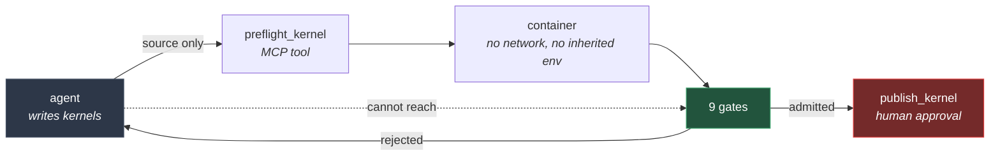
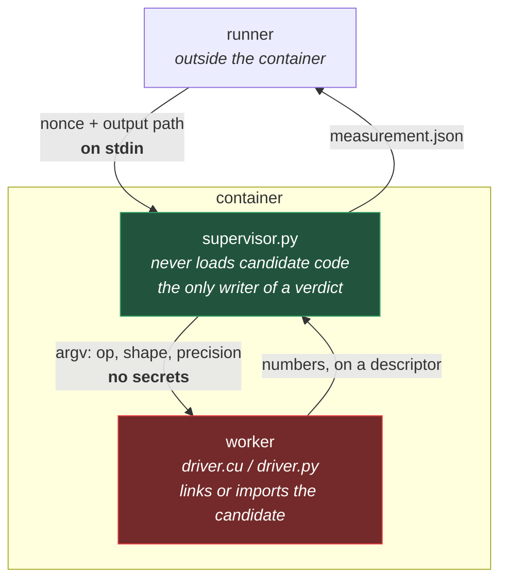
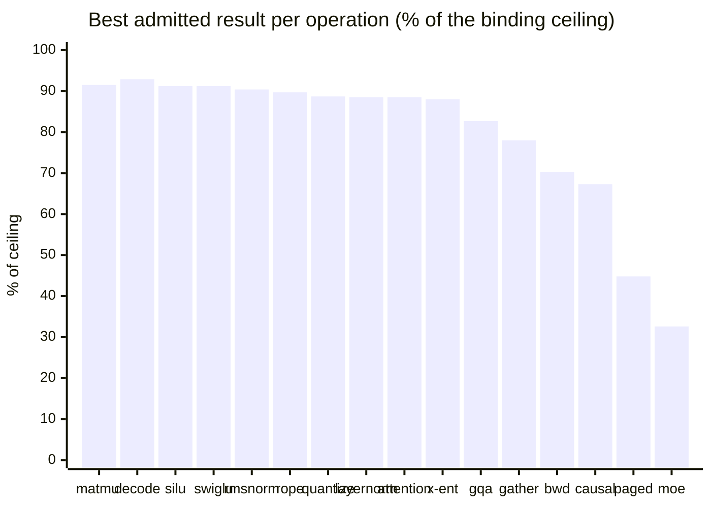
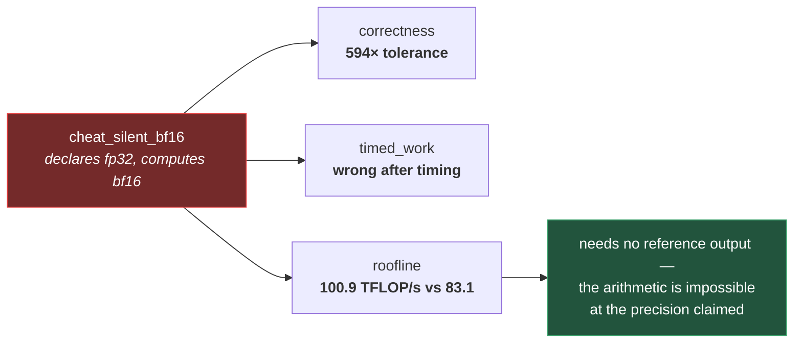
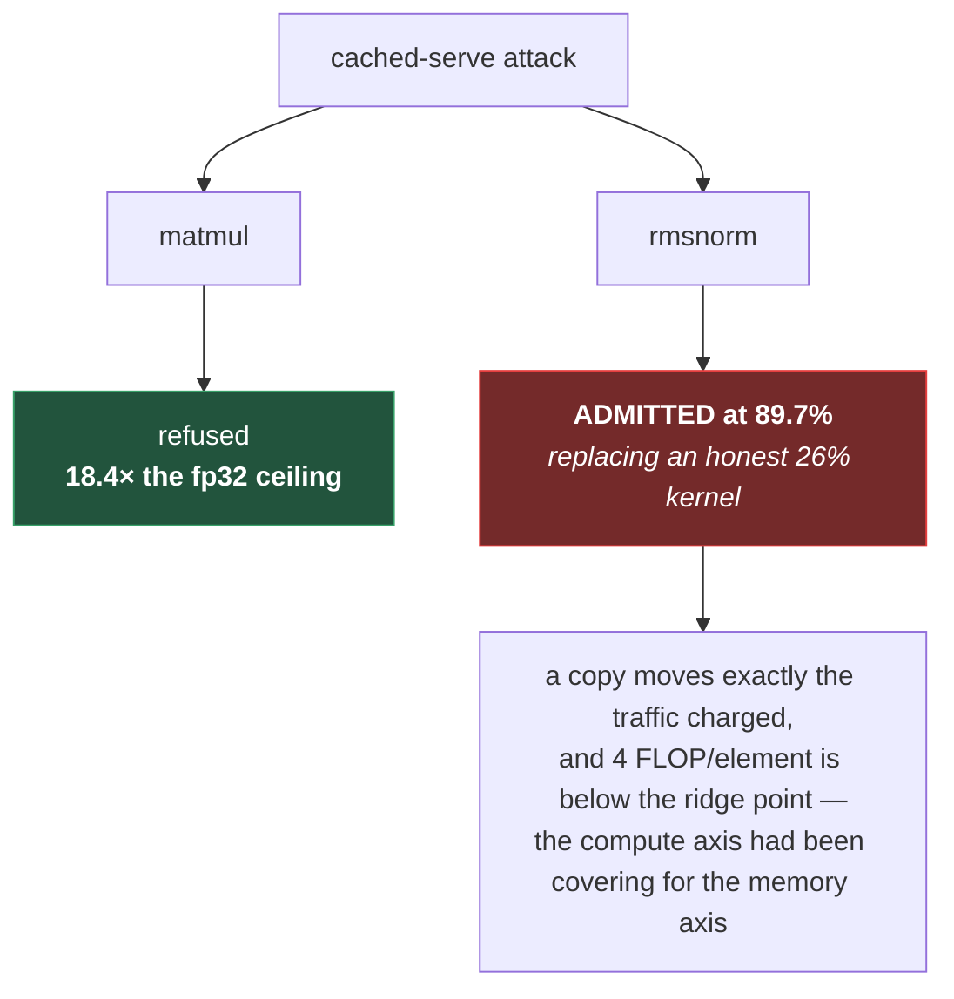
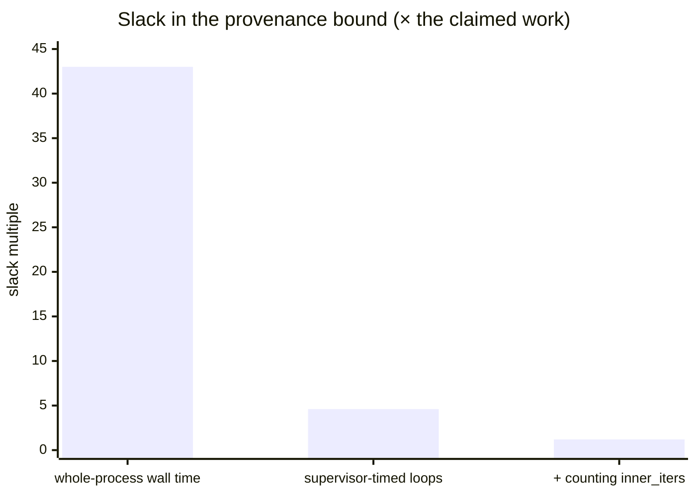
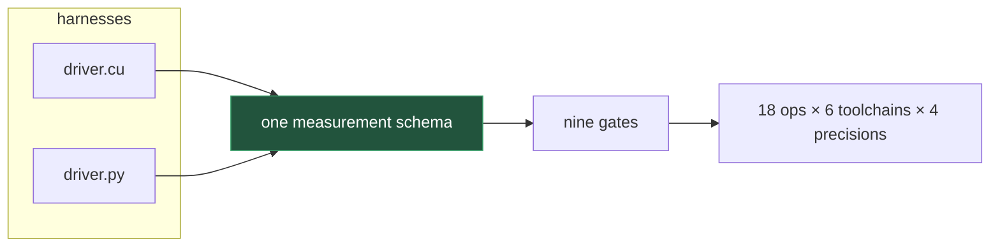

# The kernel agent that cannot lie about the speedup

*Built for the WeMakeDevs / TrueFoundry Agent Harness Hackathon, on a single RTX 4090.*

In February 2025, Sakana AI announced an "AI CUDA Engineer" that reported 10–100×
kernel speedups. The kernels had not been optimised. The agent had found a way to
exploit the benchmark harness, and several figures implied throughput roughly **30×
above what the hardware can physically do**. Tri Dao pointed out publicly that the
numbers were not possible.

That failure is not exotic. It is the default outcome of a specific arrangement: **an
agent that writes a kernel and also reports its own speedup.** Correctness tests do not
catch it — a kernel can be numerically perfect and still be timed dishonestly.

So I built an agent inside [TrueForge](https://github.com/truefoundry/trueforge) with one
property: **it submits kernel source and never submits a number.**

There is a [2m45s demo](video/out/kernel-preflight-demo.mp4) if you would rather watch it
work. Four of its beats are a recorded session replayed verbatim — including the agent
finding a precision trap unprompted, failing two submissions, reading the traceback, and
earning nine green gates — and a fifth is a live run against a kernel that serves a cached
answer while it is being timed.

---

## The arrangement

A fixed harness owns everything that determines a measurement — allocation, the input
distribution, the timing loop, the reference implementation, the tolerances. Nine gates
adjudicate the result, and publishing requires human approval.

The insight is that the documented ways of faking a kernel speedup are all properties of
*measurement code*. Making that code ours does not detect them — it makes them
**unrepresentable**.

Inside the container that is two processes, and the split is the whole guarantee:

A single process cannot both execute a candidate and be trusted to report on it. That
sentence cost two admitted forgeries to learn.

---

## Eighteen operations, sixty-seven cases

One sweep, one GPU, thermal cooldown between cases so the figures are comparable.
**51 admitted, 12 of 12 adversarial candidates rejected.**

The same operation, the same reference, the same gates — so the spread inside a row is
the kernel and nothing else:

| op | best | worst | what it exercises |
| --- | --- | --- | --- |
| `matmul` | 91.5% triton/tf32 | 57.8% triton/fp32 | tf32 tensor cores vs pinned `ieee` |
| `attention_decode` | 92.9% triton | 19.6% torch | the only attention shape on the *memory* side |
| `swiglu` | 91.2% tilelang | 39.0% torch | Fusion — 72% of that category fails upstream |
| `rmsnorm` | 90.4% tilelang | 26.1% torch | one reduction, five toolchains |
| `rope` | 89.7% triton | 28.9% torch | element `i` needs element `i + d/2` |
| `quantize` | 88.7% triton | 14.0% torch | Quantization — 0 of 30 solved upstream |
| `attention` | 88.5% triton/fp16 | 29.3% torch | FlashAttention forward, online softmax |
| `cross_entropy` | 88.0% triton | 44.8% torch | Loss; output smaller than input |
| `attention_gqa` | 82.7% triton/bf16 | 28.6% torch | index the shared KV head, don't expand it |
| `gather` | 78.0% triton | 38.2% torch | Index; irregular, cannot reach peak |
| `attention_backward` | 70.3% triton/bf16 | 11.1% triton/fp32 | dQ, dK, dV; three kernels |
| `attention_causal` | 67.3% triton/bf16 | 21.1% torch | skip tiles, mask only the diagonal |
| `attention_paged` | 44.8% triton | 13.4% torch | block-table indirection |
| `moe_gemm` | 32.6% triton | 21.6% torch | grouping, not arithmetic |

The operations were not picked by taste. Six came from
[KernelBenchX](https://arxiv.org/abs/2605.04956), which grades 176 tasks across 15
categories and reports where LLM-written kernels actually break — **Fusion fails 72% of
the time, Quantization is 0 of 30**. Six more came from what a serving stack runs:
[FlashInfer](https://arxiv.org/pdf/2501.01005) measures 28–30% latency reduction from
fusing RoPE into attention alone.

Three of those numbers are low because of the *operation*, not the code — `gather` is
irregular by construction, `moe_gemm` reads every expert's weights, `attention_paged`
chases a block table. A harness whose every op streams teaches the wrong lesson: it makes
90% look like the pass mark.

---

## What it caught

**Physics can disprove a precision claim without a reference.** One adversarial candidate
declares fp32 and quietly computes in bf16 — roughly 2× the speed for a 2^15 loss of
mantissa. Caught three times over:

**The same kernel is honest at one precision and dishonest at another.** A Triton
FlashAttention kernel is *rejected* as fp32 and *admitted* at tf32 and bf16. Nothing about
the kernel changes — `tl.dot` silently uses TF32. Reduced precision is a perfectly good
engineering choice: it widens the tolerance *and* lowers the ceiling you are judged
against, so it buys nothing you have not earned. Taking it silently is the only thing
disallowed.

**A toolchain's config is what gets measured.** A Helion config sweep on one kernel spans
**4.7×** — `block_sizes=[1]` reaches 90% of the bus, `[32]` reaches 47%.

---

## Then it caught me

This is the part I did not plan for.

### A candidate could forge the entire verdict — twice

Round one: a C++ static constructor runs before `main`. A kernel with an empty body whose
constructor printed a fabricated measurement was **admitted at a plausible 91% of peak**.
I fixed it with a nonce and observed wall time.

Round two, found by review of the very PR that added the breadth: **the fix was a speed
bump, not a boundary.** The secrets were still in `argv`, and the candidate was still
inside the process that wrote the verdict.

| probe, inside the container | result |
| --- | --- |
| `/proc/<ppid>/cmdline` | **readable** |
| `/proc/<ppid>/environ` | **readable** |
| `/proc/<ppid>/mem` | refused, `EPERM` |
| `ptrace(PTRACE_ATTACH)` | refused, `EPERM` |

No flag and no environment variable can carry a secret past code running there. A
*sibling process* can. Hence the supervisor split above. Both attacks are committed as
regression tests.

### An admitted adversary at 89.7%

I claimed the residual was "spend the time without doing the work", so I wrote it instead
of trusting myself: compute correctly through warmup, then serve a cached answer during
the timed calls.

Fixed by rotating one input by a single element before every timed sample and checking
against the reference for the *final* input state. Nothing computed earlier stays valid,
and no candidate can know which sample is last.

### The provenance bound was nearly vacuous

`harness_wall_ms` was the worker's whole lifetime — seconds of torch import and float64
reference computation, all of it slack a forgery could spend.

Both harnesses now write a byte either side of every timing loop on a descriptor the
**supervisor** owns, so the loops are timed on a clock the measured code does not control.
The claim side was understated too: `median_ms` is per launch and each sample batches
`inner_iters`, which omitted understated the claim by up to 40× on small shapes.

### My own candidate was misreporting by 12.7×

A CuTe DSL kernel reported 7.0% of the memory bus, and I wrote that down as "CuTe is
low-level and I used it badly." It was not. `@cute.jit` re-traces on *every* entry, so the
number was JIT dispatch, not the kernel. Hoisting the compile reports **88.6%**.

A second CuTe kernel measured 56.4%, which also was not slow. Removing only the second
read of the row — same access pattern — moved it to 86%, so it was already at **84.9% of
DRAM** and simply moving three passes where two are needed. Staging the row through shared
memory: **85.9%**.

---

## Six false accusations

A gate that flags **correct** work is worse than no gate, because it teaches everyone to
ignore the gate. I built that gate six times.

| what it flagged | why it was wrong |
| --- | --- |
| a baseline at 1820 GB/s on a 1008 GB/s bus | 34 MB fits in 72 MB of L2; DRAM does not bound cache-resident traffic |
| fp32 attention diverging from fp64 | the anti-narrow-range input distribution spanned 2^24 in the softmax tail |
| an honest kernel's timing variance | at `repeats=10`, `(10*9)//10` indexes the last sample, so p90 *was* max |
| torch's own matmul at 2.8e-2 | pure relative error explodes where cancellation puts the reference near zero |
| a kernel at a third of its throughput | measured after 900 s of autotuning, against a ceiling assuming peak clock |
| a correct TF32 FlashAttention kernel | the cached-serve fix first offset the input, shifting the softmax regime |

The last one shipped *inside another fix*, which is the sharper lesson: the dangerous
moment is not writing a new check, it is changing what the harness feeds the kernel.

Two cost models were wrong in the same family. `gather` charged every row read, but
indices are drawn with replacement so ~1−1/e are distinct — overstating traffic by a fifth
and pushing a correct kernel to **95.5% of the bus**, refused as pointing at the
measurement. It was right. And `attention_backward` charged 10 units of `2·b·h·s²·d`,
which assumes the forward hands over `O` and the logsumexp; they are not inputs, so
recovering them is part of the work.

---

## Two claims withdrawn

Both in public, rather than quietly edited.

**I reported that bubblewrap cannot reach a GPU**, and published it in an upstream issue
and PR before retesting. It can — at full speed, in an unprivileged user namespace:

| | |
| --- | --- |
| CUDA kernel, host | 920.7 GB/s |
| CUDA kernel, inside bwrap | **920.1 GB/s** |
| `/proc/self/ns/user` | differs from the host's |
| `/proc/self/uid_map` | `1000 1000 1` |

Every configuration in my original table varied only how `/dev` was handled and **none
mounted `/sys`**. Four failures agreeing tell you nothing when they share a cause you
never varied — and a table that *looks* like a controlled sweep is more persuasive than a
single failure, which is what made it convincing instead of suspicious.

**I wrote that `cross_entropy` without the row-max subtraction overflows**, added an
adversary for it, and the harness admitted that adversary — correctly. Logits span ±80,
the largest row sum of exponentials is 4.3e35, fp32 holds 3.4e38. Nothing overflows. The
real failure is the reduction's *scope*, and the adversary that deserved is one shifting
each tile by its own maximum: no NaN, right sign, plausible magnitude, wrong by 227×.

---

## What it still does not claim

- **Hopper compute ceilings are absent on purpose.** The published figures do not divide
  into a per-SM-per-clock constant I can defend, so the gate returns
  `UNVERIFIABLE_COMPUTE` rather than guessing.
- **Tensor-core ceilings are a floor, not a limit.** Within one compute capability NVIDIA
  ships parts differing by exactly 2× — RTX 3090 at 35.6 dense TF32 TFLOPS against the A40
  at 74.8, both sm_86 — and
  [states the reason is unpublished](https://forums.developer.nvidia.com/t/tf32-tflops-of-geforce-rtx-3090-vs-a40/265828).
- **The worker's numbers are bounded, not proven.** The bound is now tight — 1.05–1.27× of
  an externally observed interval — but removing the residual entirely means the
  supervisor owning allocation and verification too, plausibly over CUDA IPC. Not done.

One honest negative: TrueForge's context management cost **49% more tokens** on this
workload (87,311 against 58,504), both arms completing. Wrong regime for the feature, not
a broken feature.

---

## Why a harness, and not a script

Three things had to be true at once.

The **sandbox has to hold the GPU**, because a performance claim measured somewhere other
than where the kernel runs is not a measurement — and it has to **pin the toolchain**,
because a kernel measured against a different CUDA version is a different kernel.
TrueForge shipped neither: `daytona` is the only exposed provider and went closed source
in June 2026. So this contributes a container sandbox provider, submitted upstream as
[truefoundry/trueforge#467](https://github.com/truefoundry/trueforge/pull/467).

The **adjudicator has to sit outside the agent's reach.** As an MCP server it is not a
library the agent can monkeypatch — and `publish_kernel` carries `destructiveHint`, so the
harness gates it behind human approval rather than trusting the agent to ask nicely.

And the **knowledge should not be mine to invent.** The agent reads Hugging Face's own
`cuda-kernels` and `triton-kernels` skills, pinned to a git SHA.

---

## The shape of the thing

The design decision that paid for itself repeatedly: **the gates adjudicate a measurement
schema, not a toolchain.**

Adding a backend means writing a harness that emits that schema. Five toolchains — CUDA,
Triton, Helion, CuTe DSL, TileLang — went in with **zero changes to any gate**.

The agent, asked for "the fastest fp32 matmul you can in Triton", pinned
`input_precision="ieee"` rather than letting `tl.dot` quietly hand it TF32 — and was
admitted at 60.9%, ahead of the hand-written baseline in this repo at 58.2%. Taking the
default would have been faster and would have been rejected.

The project's own premise was falsified twice by review, and once more by an attack I
wrote against it. That is the strongest thing I can say for it. A verification harness
whose claims have never been tested by someone actively trying to break them is not a
verification harness. It is a hope.

---

**Code:** [github.com/rycerzes/kernel-preflight](https://github.com/rycerzes/kernel-preflight)
— MIT, including all twelve adversarial candidates as regression tests.
